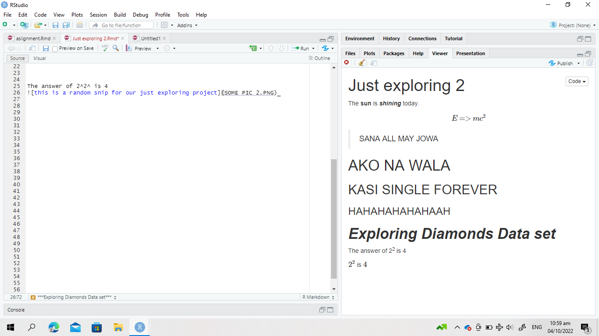

The **sun** is ***shining*** today.

$$E=>mc^{2}$$

>SANA ALL MAY JOWA 

# AKO NA WALA {#anchor}
## KASI SINGLE FOREVER {#css_id}
### HAHAHAHAHAHAAH 

# ***Exploring Diamonds Data set***

The answer of 2^2^ is 4

$2^2$ is $4$
