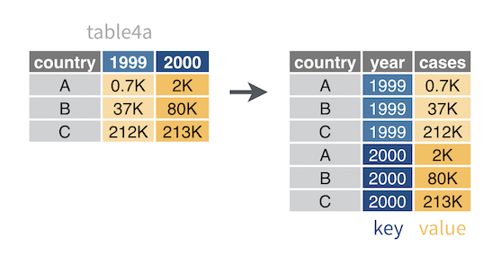

First, we are going to load the tidyverse package 
.

```{r}
library(tidyverse) # Loading necessary package
```


# Creating a table
```{r}
tribble(~number, ~letter,   ~greek,
              1,     "a",  "alpha",
              2,     "b",   "beta",
              3,     "c",  "gamma")
```

```{r}
y <- tibble(number = c(1, 2, 3), 
       letter = c("a", "b", "c"),
       greek = c("alpha", "beta", "gamma"))
```

# Convert a Data frame to a tibble 

```{r}
x <- iris # iris is still a data frame
```

```{r}
x <- as_tibble(x) #This will make x a tibble
```

```{r}
class(x) # verifying if x is already a tibble
```

# Convert a data frame to a tibble

```{r}
z <- table1

```

```{r}
z
```


```{r}
class (z)
```

```{r}
z <- as.data.frame(table1)
```

# INSPECT EVERY CELL OF A TIBBLE

```{r}
S <- storms
```

```{r}
View(storms)
```


# Spread a pair of columns into a field of cells
```{r}
table2 # undidy data
```

```{r}
table2_tidy <- table2 %>%  # and then
  spread(key = type, value = count)
table2_tidy
```


# Gather a field of cells into a pair of columns



```{r}
table4a
```


```{r}
table4a %>% 
  gather(key = "year", value = "cases", 2:3)
```

# Separate a column into new columns

```{r}
table3
```

```{r}
table3_sep <- table3 %>%
  separate(col = rate, 
           into = c("cases", "population"), 
           sep = "/", 
           convert = TRUE)
table3_sep
```


